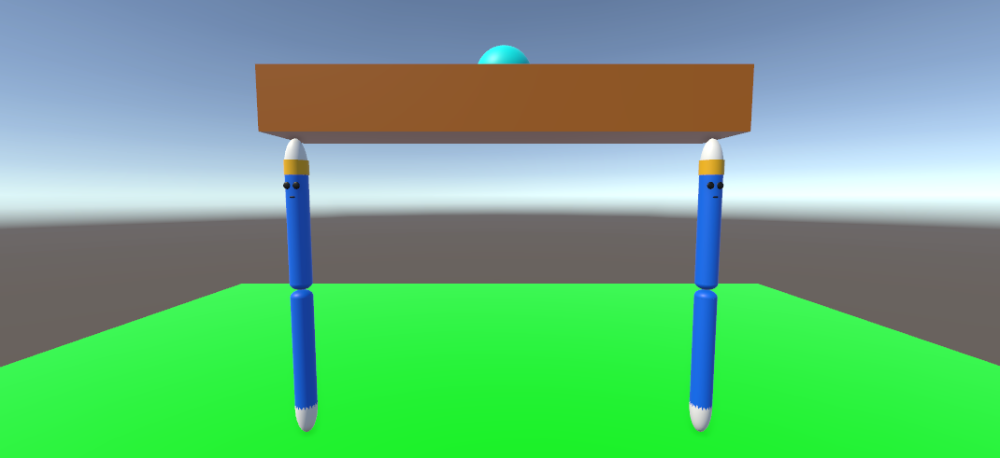
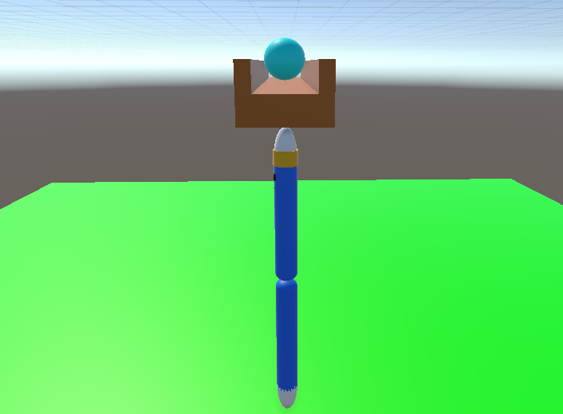
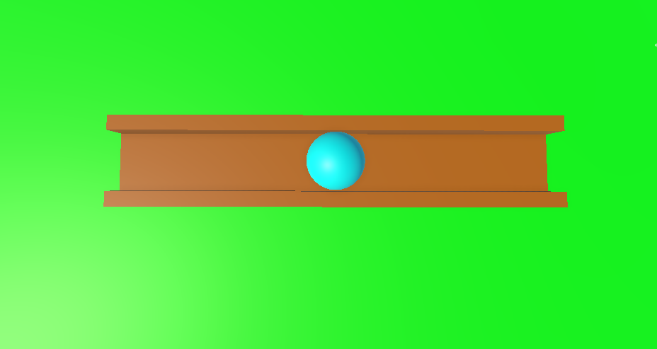

# BalanceBall

   
  

BalanceBall is an ML-Agents project. It is a multi-agent environment with two agents as the legs of a narrow table. The objective of the agents is to balance the ball at the center of the table.